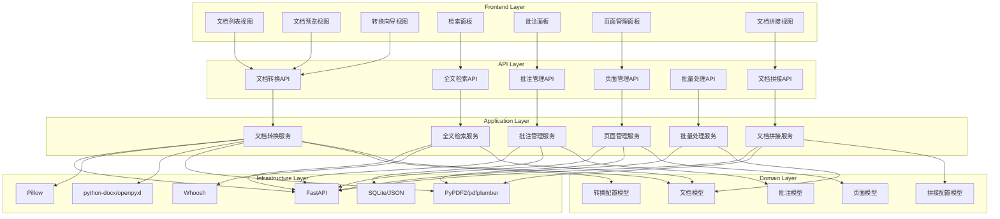

# Document Processor

Feature Name: document-processor
Updated: 2026-02-26

## Description

文档处理工具是一个基于Python的Web应用，支持PDF、Word、Excel、PPT、图片等常见格式的文档转换、检索、批注和页面管理，并提供文档拼接功能。采用本地部署方式，适用于个人和小团队场景。

## Architecture

### 系统架构图



### 技术栈选择

| 层级 | 技术选择 | 说明 |
|------|---------|------|
| 后端框架 | FastAPI | 高性能异步Web框架 |
| 前端框架 | Vue 3 + TypeScript | 响应式UI，类型安全 |
| 构建工具 | Vite | 快速开发体验 |
| UI组件库 | Element Plus | 企业级组件支持 |
| 状态管理 | Pinia | 轻量级状态管理 |
| PDF处理 | PyPDF2, pdfplumber, reportlab | PDF解析、生成和操作 |
| Word处理 | python-docx, docx2pdf | Word文档读写和转换 |
| Excel处理 | openpyxl, pandas | Excel文档处理 |
| PPT处理 | python-pptx | PowerPoint文档处理 |
| 图片处理 | Pillow | 图片处理和转换 |
| 全文检索 | Whoosh | 高性能全文搜索 |
| 数据存储 | SQLite | 轻量级数据库 |
| 文件处理 | aiofiles | 异步文件操作 |

### 目录结构

```
document-processor/
├── backend/                # Python后端
│   ├── app/               # 应用主目录
│   │   ├── api/          # API路由
│   │   │   ├── __init__.py
│   │   │   ├── conversion.py
│   │   │   ├── search.py
│   │   │   ├── annotation.py
│   │   │   ├── page.py
│   │   │   ├── batch.py
│   │   │   └── merge.py
│   │   ├── core/         # 核心配置
│   │   │   ├── __init__.py
│   │   │   ├── config.py
│   │   │   └── security.py
│   │   ├── models/       # 数据模型
│   │   │   ├── __init__.py
│   │   │   ├── document.py
│   │   │   ├── annotation.py
│   │   │   └── page.py
│   │   ├── schemas/      # Pydantic模式
│   │   │   ├── __init__.py
│   │   │   ├── conversion.py
│   │   │   ├── search.py
│   │   │   ├── annotation.py
│   │   │   └── merge.py
│   │   ├── services/     # 业务逻辑服务
│   │   │   ├── __init__.py
│   │   │   ├── conversion_service.py
│   │   │   ├── search_service.py
│   │   │   ├── annotation_service.py
│   │   │   ├── page_service.py
│   │   │   └── merge_service.py
│   │   ├── utils/        # 工具函数
│   │   │   ├── __init__.py
│   │   │   ├── file_utils.py
│   │   │   └── format_utils.py
│   │   └── main.py      # FastAPI应用入口
│   ├── storage/          # 文件存储
│   │   ├── uploads/      # 上传文件
│   │   ├── outputs/      # 输出文件
│   │   ├── thumbnails/   # 缩略图
│   │   └── db/          # 数据库文件
│   ├── tests/            # 测试
│   │   ├── __init__.py
│   │   ├── test_conversion.py
│   │   ├── test_search.py
│   │   └── test_merge.py
│   ├── requirements.txt   # Python依赖
│   └── pyproject.toml    # 项目配置
├── frontend/            # Vue前端
│   ├── src/
│   │   ├── components/
│   │   │   ├── document/
│   │   │   ├── search/
│   │   │   ├── annotation/
│   │   │   ├── page/
│   │   │   ├── merge/
│   │   │   └── common/
│   │   ├── composables/
│   │   ├── services/
│   │   ├── stores/
│   │   ├── types/
│   │   └── utils/
│   ├── package.json
│   └── vite.config.ts
└── README.md
```

## Components and Interfaces

### 文档转换服务 (ConversionService)

```python
from typing import Optional, List
from pydantic import BaseModel
from pathlib import Path


class ConversionOptions(BaseModel):
    preserve_formatting: bool = True
    quality: Optional[int] = 90
    password: Optional[str] = None
    include_annotations: bool = False


class ConversionResult(BaseModel):
    success: bool
    output_path: Optional[str] = None
    output_format: str
    warnings: List[str] = []
    error: Optional[str] = None


class ConversionService:
    async def pdf_to_word(
        self, file: Path, options: ConversionOptions
    ) -> ConversionResult:
        """PDF转Word"""
        pass

    async def word_to_pdf(
        self, file: Path, options: ConversionOptions
    ) -> ConversionResult:
        """Word转PDF"""
        pass

    async def pdf_to_excel(
        self, file: Path, options: ConversionOptions
    ) -> ConversionResult:
        """PDF转Excel"""
        pass

    async def excel_to_pdf(
        self, file: Path, options: ConversionOptions
    ) -> ConversionResult:
        """Excel转PDF"""
        pass

    async def pdf_to_ppt(
        self, file: Path, options: ConversionOptions
    ) -> ConversionResult:
        """PDF转PPT"""
        pass

    async def ppt_to_pdf(
        self, file: Path, options: ConversionOptions
    ) -> ConversionResult:
        """PPT转PDF"""
        pass

    async def images_to_pdf(
        self, files: List[Path], options: ConversionOptions
    ) -> ConversionResult:
        """图片转PDF"""
        pass

    async def pdf_to_images(
        self, file: Path, options: ConversionOptions
    ) -> List[ConversionResult]:
        """PDF转图片"""
        pass
```

### 全文检索服务 (SearchService)

```python
from typing import List, Optional
from pydantic import BaseModel


class SearchOptions(BaseModel):
    case_sensitive: bool = False
    whole_word: bool = False
    regex: bool = False


class SearchResult(BaseModel):
    page_index: int
    text: str
    position: dict  # {'x': float, 'y': float, 'width': float, 'height': float}


class SearchService:
    def __init__(self, index_dir: str):
        """初始化搜索服务"""
        pass

    def build_index(self, document_id: str, content: str) -> None:
        """建立索引"""
        pass

    def search(
        self, query: str, options: SearchOptions
    ) -> List[SearchResult]:
        """执行搜索"""
        pass

    def highlight_results(self, results: List[SearchResult]) -> None:
        """高亮显示结果"""
        pass
```

### 批注管理服务 (AnnotationService)

```python
from typing import List, Optional
from pydantic import BaseModel
from datetime import datetime
import uuid


class Rectangle(BaseModel):
    x: float
    y: float
    width: float
    height: float


class Annotation(BaseModel):
    id: str
    document_id: str
    page_index: int
    position: Rectangle
    content: str
    author: str
    color: str
    created_at: datetime
    updated_at: datetime


class AnnotationService:
    def add(self, annotation: Annotation) -> Annotation:
        """添加批注"""
        pass

    def update(self, id: str, updates: dict) -> None:
        """更新批注"""
        pass

    def remove(self, id: str) -> None:
        """删除批注"""
        pass

    def list(self, document_id: str) -> List[Annotation]:
        """获取文档批注列表"""
        pass

    def save_to_storage(self) -> None:
        """保存到本地存储"""
        pass

    def load_from_storage(self) -> None:
        """从本地存储加载"""
        pass
```

### 页面管理服务 (PageService)

```python
from typing import Optional


class PageService:
    def insert(self, index: int, page_data: dict) -> None:
        """插入页面"""
        pass

    def delete(self, index: int) -> None:
        """删除页面"""
        pass

    def move(self, from_index: int, to_index: int) -> None:
        """移动页面"""
        pass

    def rotate(self, index: int, degrees: int) -> None:
        """旋转页面"""
        pass

    def merge(self, indices: List[int]) -> None:
        """合并页面"""
        pass

    def split(self, index: int) -> None:
        """拆分页面"""
        pass

    async def get_thumbnail(self, index: int) -> Optional[str]:
        """获取页面缩略图"""
        pass
```

### 文档拼接服务 (MergeService)

```python
from typing import List
from pydantic import BaseModel


class SelectedPage(BaseModel):
    id: str
    document_id: str
    page_index: int
    original_document_name: str
    thumbnail: str
    page_width: float
    page_height: float
    rotation: int


class MergeConfig(BaseModel):
    page_size: str = 'auto'  # 'A4', 'A3', 'Letter', 'auto'
    orientation: str = 'keep-original'  # 'portrait', 'landscape', 'keep-original'
    output_file_name: str
    include_bookmarks: bool = False
    metadata: Optional[dict] = None


class MergeResult(BaseModel):
    success: bool
    output_path: Optional[str] = None
    total_pages: int
    warnings: List[str] = []
    error: Optional[str] = None


class MergeService:
    def select_page(self, selected_page: SelectedPage) -> None:
        """选择页面"""
        pass

    def deselect_page(self, page_id: str) -> None:
        """取消选择页面"""
        pass

    def select_page_range(
        self, document_id: str, start_index: int, end_index: int
    ) -> None:
        """批量选择页面范围"""
        pass

    def toggle_all_pages(self, document_id: str) -> None:
        """全选/取消全选文档的所有页面"""
        pass

    def reorder_page(self, page_id: str, new_index: int) -> None:
        """调整拼接队列中页面顺序"""
        pass

    def clear_queue(self) -> None:
        """清空拼接队列"""
        pass

    def get_queue(self) -> List[SelectedPage]:
        """获取当前拼接队列"""
        pass

    async def merge_documents(self, config: MergeConfig) -> MergeResult:
        """生成合并后的PDF"""
        pass

    async def preview_merge(self) -> List[str]:
        """预览合并结果"""
        pass
```

## Data Models

### 文档模型

```python
from pydantic import BaseModel, Field
from datetime import datetime
from enum import Enum
from typing import Optional


class DocumentType(str, Enum):
    PDF = 'pdf'
    WORD = 'word'
    EXCEL = 'excel'
    PPT = 'ppt'
    IMAGE = 'image'


class DocumentMetadata(BaseModel):
    title: Optional[str] = None
    author: Optional[str] = None
    subject: Optional[str] = None
    keywords: Optional[str] = None
    creator: Optional[str] = None
    producer: Optional[str] = None
    creation_date: Optional[datetime] = None
    modification_date: Optional[datetime] = None


class Document(BaseModel):
    id: str = Field(default_factory=lambda: str(uuid.uuid4()))
    name: str
    type: DocumentType
    size: int
    file_path: str
    created_at: datetime = Field(default_factory=datetime.now)
    modified_at: datetime = Field(default_factory=datetime.now)
    page_count: int
    thumbnail_path: Optional[str] = None
    metadata: Optional[DocumentMetadata] = None
```

### 转换配置模型

```python
class ConversionConfig(BaseModel):
    source_format: DocumentType
    target_format: DocumentType
    preserve_formatting: bool = True
    output_quality: int = Field(default=90, ge=1, le=100)
    compression_level: int = Field(default=3, ge=0, le=9)
    include_annotations: bool = False
    password: Optional[str] = None
```

### 批注模型

```python
class Annotation(BaseModel):
    id: str = Field(default_factory=lambda: str(uuid.uuid4()))
    document_id: str
    page_index: int
    position: Rectangle
    content: str
    author: str
    color: str = '#FF5722'
    created_at: datetime = Field(default_factory=datetime.now)
    updated_at: datetime = Field(default_factory=datetime.now)
```

### 页面模型

```python
class PageContent(BaseModel):
    text: Optional[str] = None
    elements: Optional[List[dict]] = None


class Page(BaseModel):
    index: int
    width: float
    height: float
    rotation: int = 0  # 0, 90, 180, 270
    thumbnail: str
    content: Optional[PageContent] = None
```

### 拼接配置模型

```python
class MergeConfig(BaseModel):
    page_size: str = 'auto'
    orientation: str = 'keep-original'
    output_file_name: str
    include_bookmarks: bool = False
    metadata: Optional[dict] = None


class MergeQueue(BaseModel):
    pages: List[SelectedPage] = []
    total_count: int = 0
    documents: set = set()
```

## Correctness Properties

### 文档转换正确性

1. **格式兼容性**: 对于每种支持的源格式和目标格式组合，转换后的文档必须能够被对应的阅读器正确打开和显示
2. **文本完整性**: 转换过程中不得丢失原文档中的任何文本内容
3. **结构保持性**: 文档的基本层级结构（章节、段落等）在转换后必须保持
4. **嵌入对象保留**: 原文档中的嵌入对象（图片、表格、公式等）在转换后必须存在

### 排版保真度正确性

1. **字体样式一致性**: 转换后的字体样式（名称、大小、颜色、粗细、斜体）与原文档的差异不超过5%
2. **位置精度**: 文本块和图像元素的位置偏移不超过原始尺寸的2%
3. **表格结构保持**: 表格的行列结构、合并单元格配置在转换后完全一致

### 检索正确性

1. **结果完整性**: 检索结果必须包含文档中所有匹配的文本片段
2. **无遗漏**: 不得遗漏任何匹配的位置
3. **无误报**: 不应返回不匹配文本的结果
4. **位置准确性**: 返回的匹配位置坐标误差不超过5像素

### 批注正确性

1. **关联一致性**: 批注必须与其关联的文本或区域正确绑定
2. **数据完整性**: 批注的创建时间、修改时间、作者等信息不得丢失或篡改
3. **持久性**: 存储的批注数据在应用重启后能够正确恢复

### 页面操作正确性

1. **索引一致性**: 页面操作后的页面索引必须连续且唯一
2. **内容完整性**: 页面移动、旋转操作不得改变页面内容
3. **合并逻辑**: 合并多个页面时，所有源页面的内容必须出现在结果页面中

### 文档拼接正确性

1. **页面顺序保持性**: 拼接结果中的页面顺序必须与用户在拼接队列中定义的顺序完全一致
2. **内容完整性**: 所有选中的页面内容必须完整出现在结果文档中，不得有遗漏或重复
3. **跨文档正确性**: 来自不同文档的页面能够正确合并到同一文档中
4. **页面尺寸处理**: 根据配置正确处理不同尺寸的页面（统一尺寸或保持原尺寸）
5. **方向一致性**: 根据配置正确处理不同方向的页面
6. **元数据准确性**: 生成的PDF元数据必须与用户配置一致

## Error Handling

### 文件处理错误

| 错误类型 | 处理策略 |
|---------|---------|
| 文件格式不支持 | 显示支持的格式列表，提示用户重新选择 |
| 文件损坏或无法解析 | 显示"文件无法解析"错误，提供重试选项 |
| 文件大小超过限制 | 显示当前限制和文件大小，提示用户压缩后重试 |
| 密码保护文档 | 弹出密码输入框，验证失败后提示错误 |
| 内存不足 | 显示"内存不足"提示，建议关闭其他文档或分批处理 |

### 转换错误

| 错误类型 | 处理策略 |
|---------|---------|
| 转换失败 | 显示具体错误信息，提供查看详情选项 |
| 部分内容转换失败 | 记录警告信息，标记问题区域，继续转换 |
| 超时 | 显示"转换超时"提示，建议简化文档或分批处理 |
| 格式特性不支持 | 列出不支持的特性，提供替代方案 |

### 检索错误

| 错误类型 | 处理策略 |
|---------|---------|
| 正则表达式语法错误 | 显示"正则表达式语法错误"，提供修正建议 |
| 搜索超时 | 显示"搜索超时"，建议缩小搜索范围 |
| 无结果 | 显示"未找到匹配结果"友好提示 |

### 批注错误

| 错误类型 | 处理策略 |
|---------|---------|
| 批注保存失败 | 显示"保存失败"，提供重试选项 |
| 批注数据损坏 | 检测到数据损坏时清除损坏数据，恢复可读部分 |
| 存储空间不足 | 显示"存储空间不足"，提示用户清理旧数据 |

### 页面管理错误

| 错误类型 | 处理策略 |
|---------|---------|
| 页面索引越界 | 禁止越界操作，显示有效范围提示 |
| 页面合并冲突 | 检测到冲突时提示用户选择操作方式 |
| 缩略图生成失败 | 显示默认图标，记录错误日志 |

### 文档拼接错误

| 错误类型 | 处理策略 |
|---------|---------|
| 拼接队列为空 | 禁用生成按钮，提示用户选择页面 |
| 页面加载失败 | 标记失败页面，继续处理其他页面，生成警告报告 |
| 文档格式不兼容 | 自动转换非PDF文档为PDF后继续，或提示用户手动转换 |
| 内存不足 | 显示"内存不足"提示，建议减少拼接页面数量或分批处理 |
| 生成失败 | 显示具体错误信息，提供重试选项 |
| 页面尺寸差异 | 显示警告信息，说明将使用统一尺寸处理 |

## Test Strategy

### 单元测试

1. **文档解析测试**: 验证各格式文档能够正确解析，提取文本和结构信息
2. **转换逻辑测试**: 验证各格式转换的结果符合预期
3. **检索算法测试**: 验证检索结果的准确性和完整性
4. **批注操作测试**: 验证批注的增删改查功能正确性
5. **页面操作测试**: 验证页面插入、删除、移动、旋转等操作的正确性
6. **文档拼接测试**: 验证页面选择、排序、合并功能的正确性

### 集成测试

1. **端到端转换测试**: 完整测试从文件上传到转换结果导出的全流程
2. **批量处理测试**: 验证批量转换的并发处理和错误隔离
3. **存储持久化测试**: 验证应用状态在刷新后的恢复能力
4. **跨文档拼接测试**: 验证从多个文档选择页面并合并的完整流程

### 兼容性测试

1. **浏览器兼容性**: 测试Chrome、Firefox、Edge、Safari各版本
2. **文档格式兼容性**: 测试不同版本生成的文档文件
3. **操作系统兼容性**: 测试Windows、macOS、Linux平台

### 性能测试

1. **大文件处理**: 测试100MB文件的加载和转换性能
2. **多文档并发**: 测试同时处理10个文档的性能表现
3. **检索性能**: 测试在100页文档中检索的响应时间
4. **内存占用**: 监控长时间使用后的内存使用情况

### 排版保真度测试

1. **自动化对比**: 使用图像对比工具计算转换前后页面的相似度
2. **人工验证**: 对转换结果进行人工抽样检查，确保排版质量

### 回归测试

每次更新后运行完整测试套件，确保新功能不影响现有功能。

## Implementation Plan

### 阶段一：基础框架搭建

1. 后端项目初始化（FastAPI + Python）
2. 前端项目初始化（Vue 3 + Vite + TypeScript）
3. 数据库设计（SQLite）
4. 基础UI组件集成（Element Plus）
5. 状态管理配置（Pinia）
6. API接口设计

### 阶段二：文档处理核心

1. PDF解析和渲染（PyPDF2, pdfplumber）
2. PDF生成（reportlab）
3. Office文档解析（python-docx, openpyxl, python-pptx）
4. 图片处理集成（Pillow）
5. 文档模型定义
6. 文件上传API开发

### 阶段三：格式转换实现

1. PDF与Word互转（python-docx, docx2pdf）
2. PDF与Excel互转（openpyxl, pandas）
3. PDF与PPT互转（python-pptx）
4. 图片与PDF互转（Pillow, reportlab）
5. 转换向导UI开发

### 阶段四：全文检索功能

1. 索引引擎集成（Whoosh）
2. 搜索界面开发
3. 结果高亮显示
4. 正则表达式支持

### 阶段五：批注编辑功能

1. 批注数据模型
2. 批注标记UI
3. 批注面板开发
4. 本地存储持久化（SQLite）

### 阶段六：页面管理功能

1. 页面缩略图生成
2. 页面操作工具栏
3. 拖拽排序功能
4. 页面旋转、删除等操作

### 阶段七：文档拼接功能

1. 文档拼接视图开发
2. 页面选择器组件
3. 拼接队列组件
4. 页面范围选择器
5. 拖拽排序功能
6. 文档合并逻辑实现

### 阶段八：批量处理

1. 批量转换逻辑
2. 进度显示
3. 结果报告

### 阶段九：优化与完善

1. 性能优化
2. 错误处理完善
3. 用户体验优化
4. 文档编写

## References

[^1]: (Website) - [FastAPI Documentation](https://fastapi.tiangolo.com/)
[^2]: (Website) - [PyPDF2 Documentation](https://pypdf2.readthedocs.io/)
[^3]: (Website) - [pdfplumber Documentation](https://github.com/jsvine/pdfplumber)
[^4]: (Website) - [python-docx Documentation](https://python-docx.readthedocs.io/)
[^5]: (Website) - [Whoosh Documentation](https://whoosh.readthedocs.io/)
[^6]: (Website) - [Vue 3 Documentation](https://vuejs.org/)
